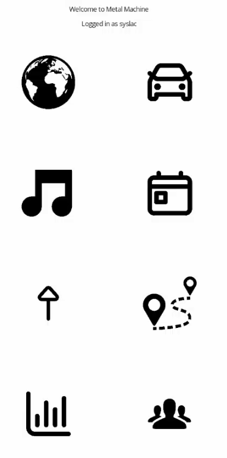
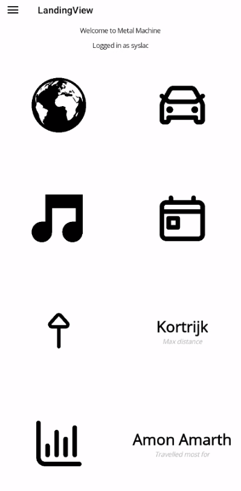
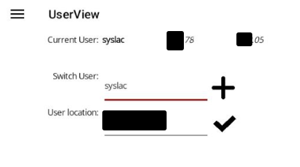

# Metal Machine

The idea for this app is to count how much you travelled for live music shows, and give the user basic stats about that.


   


This is achieved by combining data about user attendance with a geocoding layer. 
The easiest way to get both, if you are a <a href="https://www.setlist.fm/">setlist.fm</a> user, is to retrieve it through their API.

However, the app provides a way to be independent from any specifica API provider, as the geocoding layer can be provided by native Android API or by <a href="https://www.openstreetmap.org">OSM</a>, and it can import a CSV from the user, if the attendance data is kept manually up to date.
And also if you use setlist.fm, it provides an option to export the underlying SQLite database, as a partial cloud backup.

## Name

The name comes from the fact that I mostly travel for metal concerts, and in the genre, the "metal machine" is kind of a lyrical trope. Combine this with wanting to display data about travelling in cars, planes, and other metal machines, and it just seemed to click.

## Setup

The only setup needed to start using the app is "registering" a user name, by navigating to the User page and clicking the "+" icon next to the user name. Be aware that, if you choose to use setlist.fm as your data provider, the user entered here needs to match the one you use on setlist.fm.

No credentials are needed, since the concerts attended by user *X* are public data, so the app doesn't need to verify that the username you enter is actually you (and yes, this means you can get stats for your friends!).

Next, you should enter your location, so the app knows where to compute the distances from. Your location will be geocoded, so you can check if the location you entered is valid or not by checking whether the lat/lon coordinates displayed at the top of the page are reasonable after inputing the location, or if they are still zeroes.



## Data
Concert attendance data provided by <a href="https://www.setlist.fm/">setlist.fm</a>.

Please note that this app uses a free API key, so the requests to setlist.fm are rate limited by purpose to 1 every 2 seconds: so if you have a long history of concerts, be patient! 
Also, if you choose to modify the source code to increase speed, beware that this limit will be enforced by setlist.fm on the server side, and may lead to my key being revoked. As I don't plan to ever have any actual users for this app, this should not be a great issue for me, but if for whatever reason you plan on changing this app a lot and need serious data mining from setlist.fm, please consider applying for your own API key and change your config files to use it.

### Data - CSV option

If you choose to import a CSV, the file must be formatted as follows, with no headers, separated by ";":
| Column1 |Column2|Column3|column4|
|---------|-------|-------|-------|
|Band name|Location, long name|Location, short name|Date, yyyy-MM-dd|

Here, "long name" means the actual venue name, where available, while "short name" means maybe just the name of the City+Country, such that it could be more easily located by any of the geocoding providers included.
For example an acceptable line would be, 
```Iron Maiden;Piazza unità d'Italia, Trieste, Italy;Trieste, Italy;2017-07-27```

## Multi-platform?
Despite being a MAUI app, I don't plan to ever adapt/release an iOS, nor PC, version. This is Android-only from the beginning, and the only reason it is in MAUI is as a project to study the stack a bit.

## Icons license
* *World* icon: Vectors and icons by <a href="https://github.com/mariuszostrowski/subway?ref=svgrepo.com" target="_blank">Mariusz Ostrowski</a> in CC Attribution License via <a href="https://www.svgrepo.com/" target="_blank">SVG Repo</a>
* *Filter* icon: Vectors and icons by <a href="https://noahjacob.us/?ref=svgrepo.com" target="_blank">Noah Jacobus</a> in PD License via <a href="https://www.svgrepo.com/" target="_blank">SVG Repo</a>
* *Calendar* icon: Vectors and icons by <a href="https://dazzleui.gumroad.com/l/dazzleiconsfree?ref=svgrepo.com" target="_blank">Dazzle Ui</a> in CC Attribution License via <a href="https://www.svgrepo.com/" target="_blank">SVG Repo</a>
* *Car* icon: Vectors and icons by <a href="https://dazzleui.gumroad.com/l/dazzleiconsfree?ref=svgrepo.com" target="_blank">Dazzle Ui</a> in CC Attribution License via <a href="https://www.svgrepo.com/" target="_blank">SVG Repo</a>
* *Music* icon: Vectors and icons by <a href="https://noahjacob.us/?ref=svgrepo.com" target="_blank">Noah Jacobus</a> in PD License via <a href="https://www.svgrepo.com/" target="_blank">SVG Repo</a>
* *Up* icon: Vectors and icons by <a href="https://www.figma.com/@syalankush?ref=svgrepo.com" target="_blank">Ankush Syal</a> in CC Attribution License via <a href="https://www.svgrepo.com/" target="_blank">SVG Repo</a>
* *Map* icon: Vectors and icons by <a href="https://github.com/Viglino/font-gis?ref=svgrepo.com" target="_blank">Viglino</a> in GPL License via <a href="https://www.svgrepo.com/" target="_blank">SVG Repo</a>
* *Chart* icon: Vectors and icons by <a href="https://dazzleui.gumroad.com/l/dazzleiconsfree?ref=svgrepo.com" target="_blank">Dazzle Ui</a> in CC Attribution License via <a href="https://www.svgrepo.com/" target="_blank">SVG Repo</a>
* *Group* icon: Vectors and icons by <a href="https://github.com/kudakurage/LigatureSymbols?ref=svgrepo.com" target="_blank">Kudakurage</a> in OFL License via <a href="https://www.svgrepo.com/" target="_blank">SVG Repo</a>
* *Upload* icon: Vectors and icons by <a href="https://dazzleui.gumroad.com/l/dazzleiconsfree?ref=svgrepo.com" target="_blank">Dazzle Ui</a> in CC Attribution License via <a href="https://www.svgrepo.com/" target="_blank">SVG Repo</a>
* *Download* icon: Vectors and icons by <a href="https://dazzleui.gumroad.com/l/dazzleiconsfree?ref=svgrepo.com" target="_blank">Dazzle Ui</a> in CC Attribution License via <a href="https://www.svgrepo.com/" target="_blank">SVG Repo</a>